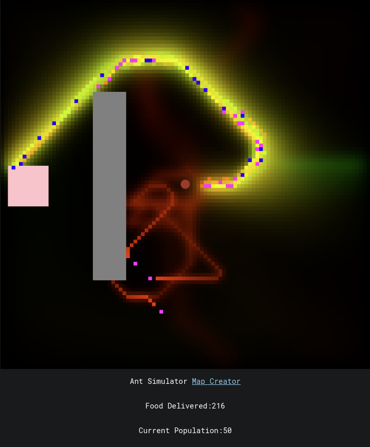

# Ants-Simulation
Ant colony simulation written in pure JavaScript.

# What is this?
<ul style="margin-top: 0px;">
    <li>Ants (purple and blue pixels) follow pheromone trails in order to find their way to and from food sources.</li>
    <li>Green pheromones attract ants who are looking for food.</li>
    <li>Red pheromones attract ants who are looking to return to the ant hill (red center circle) with food they've collected.</li>
    <li>As an ant leaves the ant hill, it produces red pheromones.</li>
    <li>As an ant leaves a food source (pink rectangle), it produces green pheromones.</li>
    <li>Overtime, trails of pheromones will form which will act to guide other ants in finding food and returning home.</li>
</ul>

Still interested?

<ul style="margin-top: 0px;">
    <li>This project was inspired by <a href="https://youtu.be/X-iSQQgOd1A">a youtube video</a> create by <a href="https://www.youtube.com/c/SebastianLague">Sebatian Lague</a> which goes into more detail.</li>
    <li>The project is being hosted <a href="https://github.com/Dmrgn/Ants-Simulation">here</a></li>
</ul>